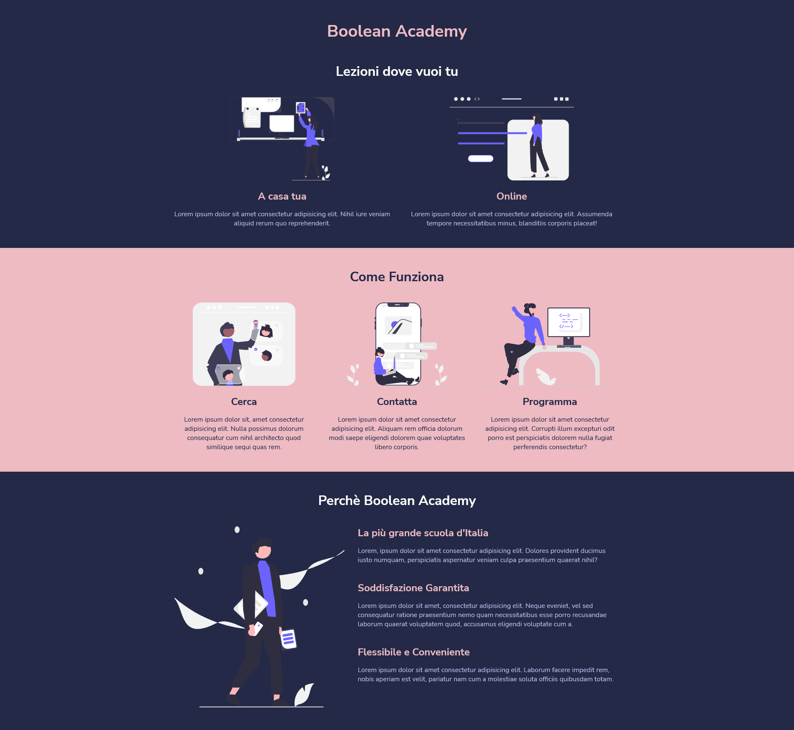

# Responsive Wannabe

> Esercizio Responsive Wannabe

## Adattare il layout ai vari dispositivi : Responsive Wannabe

* Descrizione

  Usando le CSS media queries, trasforma il repo 'html-responsive-wannabe' in una versione navigabile quando la larghezza dello schermo diventa tablet 768px , mobile 480px ,L'html e il css presenti non possono essere modificati, possiamo solo aggiungere regole per modificare l'aspetto nelle due risoluzioni indicate.

  - tablet: dai 768px in giù:
    - 

  - mobile: dai 480px in giù 
    - 

* Consigli

  - Apriamo le slide e usiamole come guida per il lavoro, aggiungiamo sempre solo un pezzettino alla volta.
Per poter vedere correttamente un sito responsive è necessaria l'aggiunta del tag:
`<meta name="viewport" content="width=device-width, initial-scale=1.0">`

* Bonus

  - Sopra i 768px e fino ai 1160px il layout è un po' troppo "rigido"! Come mai?
  Aggiungiamo una media query per sistemare il layout e non far comparire la scrollbar orizzontale.
